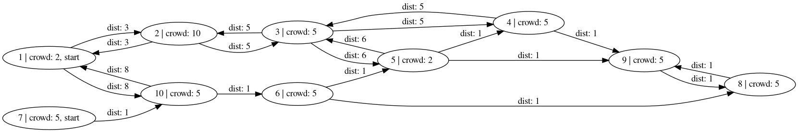

# OpraDB

OpraDB is graph database that uses [OPRA query language](https://arxiv.org/abs/1710.04419) and is written in [F#](http://fsharp.org/).
Main purpose of this project is to show the expressive power of [OPRA](https://arxiv.org/pdf/1710.04419.pdf) queries.

Ability to express complex path properties in a modular
way and with a minimum effort, is where this query language really excels.

**Note:** Although this is a work in progress, usable version is already available.

## Table of Contents

- [OpraDB](#opradb)
    - [Table of Contents](#table-of-contents)
    - [Quick start with Docker (Recommended)](#quick-start-with-docker-recommended)
    - [How to build from source (Linux)](#how-to-build-from-source-linux)
    - [How to edit in Visual Studio Code](#how-to-edit-in-visual-studio-code)
    - [How to write Opra queries](#how-to-write-opra-queries)
        - [Basics](#basics)
            - [Graph](#graph)
            - [Syntax](#syntax)
        - [Constraints](#constraints)
            - [Path constraints](#path-constraints)
            - [Node and regular constraints](#node-and-regular-constraints)
            - [Regular constraint as regular expression for path](#regular-constraint-as-regular-expression-for-path)
            - [Arithmetic constraints](#arithmetic-constraints)
        - [Let expression (Ontologies)](#let-expression-ontologies)
        - [Handling cycles](#handling-cycles)
    - [Examples](#examples)
    - [Comparison with Gremlin (Apache TinkerPop)](#comparison-with-gremlin-apache-tinkerpop)
    - [Future work](#future-work)
    - [Contribution](#contribution)

## Quick start with Docker (Recommended)

1. Install [docker](TODO:link_to_docker)
2. Get container image:

   * (Option A) Download latest image

       ```bash
       TODO: Download container image
       ```

   * (Option B) You can also build container image from local sources

       * First, clone repository:

           ```bash
           git clone ... TODO: Clone repo
           ```

3. Run container with OpraDB client and loaded database:
    ```bash
    TODO: docker run
    ```

## How to build from source (Linux)

TODO: Build section

- Install [dotnet core](https://www.microsoft.com/net/learn/get-started/linuxubuntu)
- `git clone https://github.com/mateuszlewko/OpraDB.git`
- `cd OpraDB/src`
- `dotnet build`

    Run main project with (assuming you're in `src` folder):
    `dotnet run --no-build`

    Run tests with (assuming you're in `test` folder):
    `dotnet run --no-build`

## How to edit in [Visual Studio Code](https://code.visualstudio.com/)

- Install [mono](http://www.mono-project.com/download/)
- Install [F#](http://fsharp.org/use/linux/)
- Add [Ionide](https://marketplace.visualstudio.com/items?itemName=Ionide.Ionide-fsharp) plugin to VS Code:
  - launch VS Code Quick Open (Ctrl+P)
  - paste: `ext install Ionide.Ionide-fsharp`

## How to write Opra queries

Read this sections to get a brief understanding of [Opra QL](https://arxiv.org/pdf/1710.04419.pdf) and OpraDB.

### Basics

#### Graph

Let's start by defining OpraDB graph. Graph consists of directed edges and nodes.
Each node and edge can have a set of properties. Property has a:

* key `string`
* value of one of the following types: `string`, `int`, `bool`, `float`.

Undirected graphs can be represented by adding two directed edges for each undirected edge,
in both directions.

Example graph in `json` format:

```json
{
    "nodes": [
        { "_id": 1, "crowd": 2, "start": 1 }
      , { "_id": 2, "crowd": 10 }
    ],
    "directed_edges": [
        { "_from": 1, "_to": 2, "dist": 3 }
      , { "_from": 2, "_to": 1, "dist": 3 }
    ]
}
```

**Note:** All nodes must have field `_id` with *positive* integer value. Edges
must have `_from` and `_to` properties, which point to node ids *already defined*
in `nodes` object (see example above).

#### Syntax

Query has following syntax:

```ocaml
MATCH NODES <list of matched (returned) nodes or node properties>
      PATHS <list of matched paths>
      SUCH THAT <path constraints>
      WHERE <regular constraints>
      HAVING <arithmetic constraints>
```

`MATCH`, `NODES`, `PATHS`, `SUCH THAT`, `WHERE` and `HAVING` are most used
keywords and they all must be uppercase. When creating a query you should always
specify at least one matched node or node property.

**Note:** Returning matched paths is currently **not supported**.

- List of matched nodes (`MATCH NODES`):

    Example:

    ```ocaml
    MATCH NODES a, b, someNode, property(someNode), name(someNode)
    ...
    ```
    By specifying node or node's property in matched nodes, we're essentially
    defining an alias to this node, which we can use in latter constraints.

    Usually we want to return node's property like `name(x)`. Providing just an
    alias `x` will return ids of all nodes that matched `x`'s constraints.

- `MATCH ... PATHS`:
    Behaviour for matching paths is similar to nodes, however current versions
    doesn't return paths.

### Constraints

#### Path constraints

```ocaml
path1 : beginNode -> endNode
```

Path constraints are here to specify that there is path called `path1` from node
`beginNode` to `endNode`. Both nodes could be bound earlier in *matched nodes list*,
but they don't have to be. In case a node wasn't bound earlier, it will be existentially quantified (meaning that is just needs to exists). This rule applies for all occurrences of nodes or paths not bound in `MATCH ...` list.

Multiple path constraints can be specified in query by separating them with comma.

Example:

```ocaml
MATCH NODES name(a), name(b), name(c)
SUCH THAT p: a -> b, q: a -> c
```

#### Node and regular constraints

Regular constraint specifies how correct paths should look like. It consists of
node constraints and operators: `|`, `*`. Each node constraint describes one of the nodes on a given path.

Example node constrains:

- `(access_level(people) > 3 OR position(people) = "CTO")` this constraint will be     true if *current* node on path `people` has property `access_level` that is
  greater
  than 3 or property `position` is "CTO"

*Current node* is currently checked node when traversing a path.

- `(distance(cities, 'cities) < 10)` Tick before node name (`'node`) is current node's
  successor when traversing a path. Node will satisfy this constraint, if outgoing edge (to successor) has property `distance` and its values is less than 10.

Regular constraint can just be a sequence of node constraints, like this:

```ocaml
(name(friends) = "Bol")(name(friends) = "Alice")(name(friends) = "Mateusz")
```

Path `friends` satisfies this constraint as long as it contains three nodes which
are connected by some edges, and `name` of first node is *Bob*, second *Alice* and
third *Mateusz*.

However, regular constraints can act as regular expression on paths, where instead
of letters and digits we have *node constraints*. This is where we can make use of
union `|` and Kleene-star `*` operators.

#### Regular constraint as regular expression for path

Following query returns pairs of cities in Poland and USA for which
there exists flight path:

```ocaml
MATCH NODES x, y
SUCH THAT p: x -> y
WHERE (country(p) = "Poland").*(country(p) = "USA"),
      (flight(p, 'p) IS NOT NULL)*.
```

Expression `(<node constraint>)*` will be satisfied by sequence of nodes on a path,
of any length (possibly zero). Dot `.` means that any node will match this
constraint.

In above query we have two regular constraints.
First checks that path begins and ends in appropriate countries, however, we can
flight through any country (hence `.*`). Second, ensures that there exists a flight
connection between consecutive nodes.

**Note:** Dot at the end (match any) is necessary, because when checking the constraint
for last node on a path, we don't need to ensure that there is a property `flight`
on edge outgoing from last node (there may not be).

In next example let's that we want to travel from Poland to USA only through specific countries:

```ocaml
MATCH NODES x, y
SUCH THAT p: x -> y
WHERE (country(p) = "Poland")((country(p) = "Canada") | (country(p) = "Germany"))*
(country(p) = "USA"), (flight(p, 'p) IS NOT NULL)*.
```

#### Arithmetic constraints

In order to constrain arithmetic properties of paths, you can use following
keywords: `SUM`, `MAX`, `MIN`. They will perform aggregated operation on nodes or
edges. Then they can be compared to other aggregated operations or constants inside
`HAVING` clause.

Example:

```ocaml
MATCH NODES x, y
SUCH THAT p: x -> y
WHERE (country(p) = "Poland").*(country(p) = "USA"),
      (flight(p, 'p) IS NOT NULL)*.
HAVING SUM (dist(p)) < 8000, MAX (duration(p, 'p)) <= 6
```

This will constrain length of trip from Poland to USA, to be shorter than 8000 km
and make sure none of the flights exceeds 6 hours.

Following query ensures that return trip will be shorter than the first one:

```ocaml
MATCH NODES x, y
SUCH THAT p: x -> y, q: y -> x
WHERE (country(p) = "Poland").*(country(p) = "USA"),
      (flight(p, 'p) IS NOT NULL)*.
HAVING SUM (dist(p)) < 8000, SUM (dist(q)) < SUM (dist(p))
```

### Let expression (Ontologies)

You may have already noticed that some constraints are duplicated and make queries more obscure. `Let expressions` allow to modularize and greatly simplify a query while maintaining it's expressive power.

`Let` syntax is as follows:

```ocaml
LET <name> <list of bound nodes or paths> =
    <let body> IN
LET ... = ... IN
MATCH ...
```

`Let body` can be one of:

- Value expression or node constraint:

  ```ocaml
  LET duration x = 60 * distance(x) / speedLimit(x) IN
  LET isAirport x = type(x) = "airport" IN
  ```

  Which can be used as part of other constraints:

  ```ocaml
  ...
  MATCH ...
  WHERE (isAirport(p)).*
  HAVING SUM (duration(p)) < 10
  ```

- Regular constraint or arithmetic constraint:

```ocaml
LET route p = (isAirport(p) AND (flight(p, 'p) IS NOT NULL))*. IN
LET inRange p = SUM (dist(p)) < 100 IN
MATCH ...SUCH THAT path: ...
WHERE route(path)
HAVING inRange(p)
```

- Query:

```ocaml
LET shop x = type(x) = "shop" IN
LET shopsNearHome s =
    MATCH NODES s
    SUCH THAT p: s -> home
    WHERE (shop(p)).*(address(p) = "My home location")
    HAVING SUM (distance(p)) < 4 IN

MATCH NODES address(shop)
SUCH THAT p: work -> shop
WHERE (address(p) = "My work location").*(shopsNearHome(p))
HAVING SUM (distnace(p)) < 4
```

Above query returns location of all shops near home and work.

**Note:** All `let` expressions must come before `match` query, and they can't be mutually recursive.

### Handling cycles

As arithmetic constraints can be quite complicated and they can be applied on
graphs with positive and negative cycles, OpraDB uses following algorithm to check whether paths satisfy these constraints:

1. First all paths that satisfy regular constraints are found.
2. For each path, we retrieve all simple cycles (using Johnson's algorithm) and
   calculate delta value of each property (that exists in arithmetic constrains).
3. With all aggregated values for every property and delta of property values
   for each cycle, we construct a set of linear inequalities, that includes variables representing number of times to traverse a given cycle.
4. We solve this set of inequalities using [Z3](TODO:link) solver to find out
   how many times to traverse each cycle. If no positive solutions where found it means that path doesn't satisfy arithmetic constraints.

## Examples

In these examples we'll use following graph:



Labels with values above nodes and edge are properties. Numbers are node identifiers.
This graph in `json` format can be found [here](./examples/basic/graph.json).

- Plan a route that avoids crowded places.

  ```ocaml
  LET crowded x =
      MATCH NODES x
      SUCH THAT q: x -> y
      WHERE .*(crowd(q) >= 10)
      HAVING SUM (dist(q, 'q)) <= 10 IN
  MATCH NODES x, y
  SUCH THAT p: x -> y
  WHERE (crowded(p) = false)*, (start(p) IS NOT NULL).* ;
  ```
  
  Expected result:

  | x | y  |
  |---|----|
  | 7 | 9  |
  | 7 | 8  |
  | 7 | 5  |
  | 7 | 6  |
  | 7 | 10 |

- Traverse cycle multiple times to satisfy arithmetic constraint.

  This query shows OpraDB's ability to find non trivial paths that satisfy complex arithmetic constraints efficiently. 

  TODO: Query with cycle

- TODO: All nodes that lie on a cycle TODO: new graph + image

## Comparison with [Gremlin (Apache TinkerPop)](http://tinkerpop.apache.org/)

Now, we'll compare these graph query languages on [air routes](./examples/flight-routes/air-routes.graphml) dataset (contains description of the data).

**Note:** This graph is in [graphml format](https://en.wikipedia.org/wiki/GraphML?oldformat=true), which is also supported by OpraDB (apart from json).

- All flight connections outgoing from Wroclaw (WRO) airport:

  OpraQL:

  ```ocaml
  LET r q = labelE(q, 'q) = "route" IN
  MATCH NODES code(a), code(b) SUCH THAT p: a->b
  WHERE (code(p) = "WRO").*, (r(p)). ;
  ```

  Gremlin:

  ```groovy
  g.V().has('code', 'WRO').out('route').path().by('code')
  ```

- Connections from any airport in Poland to any airport in Germany that go through Munich.

  OpraQL:

  ```ocaml
  LET route q = labelE(q, 'q) = "route" IN
  MATCH NODES code(a), code(b) SUCH THAT p: a -> b
  WHERE (country(p) = "PL")(city(p) = "Munich")(country(p) = "DE"),
        (route(p))(route(p)). ;
  ```

  Gremlin:

  ```groovy
  g.V().has('airport','country', 'PL').as('pl').out('route') \
       .has('airport', 'city', 'Munich').out('route').has('country', 'DE') \
       .as('de').select('pl', 'de').by('code').by('code')
  ```

## Future work

- [ ] Returning paths.
- [ ] Finding shortest paths.
- [ ] Time and memory optimizations.
- [ ] Improve query execution time complexity for multiple paths
- [ ] Results visualization with web client.

## Contribution

If you have any thoughts or request, feel free to create an issue or add a pull request. Feedback is welcome.